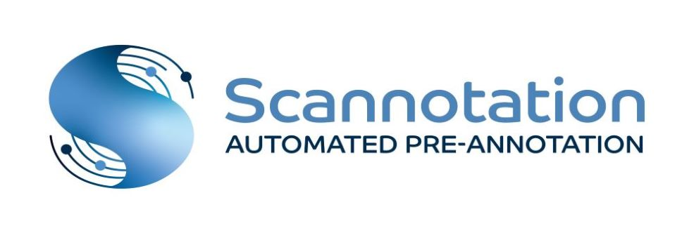

Scannotation is an automated and user-friendly suspect screening tool for the rapid pre-annotation of LC-HRMS datasets.
This software combines several MS1 chemical predictors: m/z, retention times, isotopic patterns and neutral loss patterns, to score the proximity between features and suspects, thus efficiently prioritizing compounds of interest.

## Development
Scannotation was developed on Windows 10 and tested on both Windows and on a Mac computer in a Windows virtual machine.

## Tutorial
Please read our [tutorial](https://github.com/scannotation/Scannotation_software/blob/master/Scannotation-tutorial.docx) to get started with Scannotation.

## Technical support
If you encounter any problems, please contact the developers at this address: scannotation@ehesp.fr
